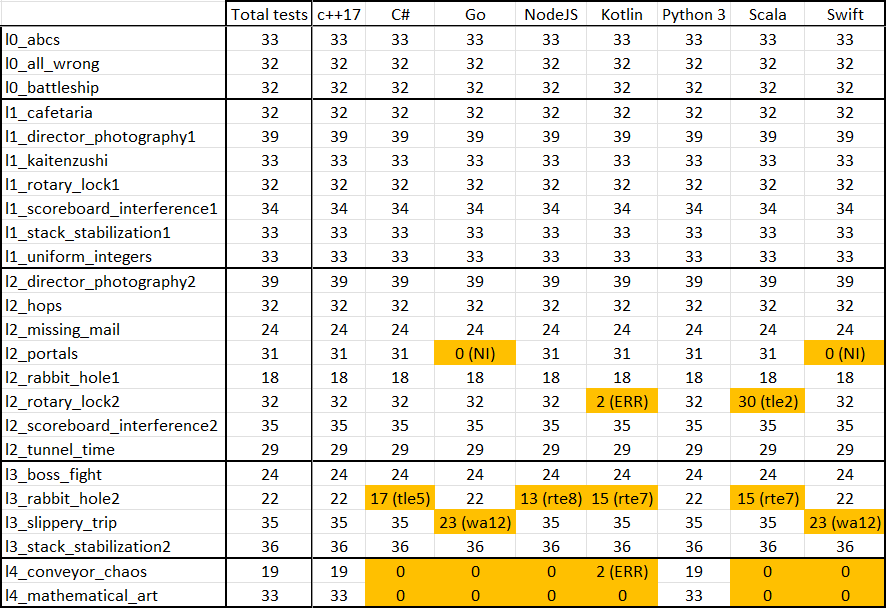
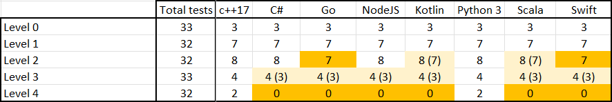

# meta_puzzles

Author: [Sébastien Rubens](https://www.linkedin.com/in/sebastienrubens/)

----

## Licensing (creative commons CC0)

To the extent possible under law, the person who associated CC0 with
meta_puzzles has waived all copyright and related or neighboring rights
to meta_puzzles.

You should have received a copy of the CC0 legalcode along with this
work.  If not, see <http://creativecommons.org/publicdomain/zero/1.0/>.

The author has not registered any patent or trademark about the work provided, which was written from scratch, without any inspiration from any other works.

----

## Overview

meta_puzzles are solutions, in multiple languages, to all (24) Meta/Facebook puzzles available on Meta's careers website at https://www.metacareers.com/profile/coding_puzzles/.

The solution to Meta's puzzles will be used in a multi-language comparison and find which languages would be suitable for different purpose. All solutions provide the unit tests provided by Meta and, possibily, some additional tests.  All solutions have been tested on Meta's website.

This first phase is about comparing basic language ecosystems, i.e. the language itsels with some basic collections out-of-the-box.

----

## Solutions Explanations

Solutions are explained [here](doc%2Freadme.md)

----

## Want to contribute?

Any contribution (code, comments, criticism) is more than welcome.

While I have had to write code in all sort of languages (including some obscure Ada,Cobol, Prolog, Lisp, Pascal, etc) during my academic or professional life, I am mostly a C\++ and Python programmer these days, so if you feel I mistreated a particular language, please contribute!

----

## Comparison of solutions

* NI = Not Implemented
* ERR = Unexpected error with Meta's website ("We were unable to process your submission...").
* RTE = Runtime Exception
* TLE = Time Limit Exceeded
* WA = Wrong Answer

* Total is the number of solution implemented out of 24 problems.
* When provided, in parenthesis is the number of solutions fully working on Meta's website (i.e. within time limits).
* Compatibility is indicative and corresponds to what I have installed locally (Meta is probably using much lower version numbers).
* C++ and Rust are the only 2 languages have collections to implement all solutions out of the box.
* Python can implement all solutions by using [sortedcontainers](https://pypi.org/project/sortedcontainers/), which is almost standard.

----

## Data structures needed

Solutions requiring a sorted associative collections such as [Red–black trees](https://en.wikipedia.org/wiki/Red%E2%80%93black_tree)
* l2_portals: trees are used to implement a priority queue and are replaced by Heap in is some language when not available
* l4_conveyor_chaos
* l4_mathematical_art
* Note on Rust: provides [TreeMap (a B-tree implementation)](https://en.wikipedia.org/wiki/B-tree) as a replacement, and offer and [range](https://doc.rust-lang.org/std/collections/struct.BTreeMap.html#method.range) function to to implement lower_bound and upper_bound search (both lower_bound and upper_bound are available but as experimental API).

Solutions requiring a [Hash Table](https://en.wikipedia.org/wiki/Hash_table)
* l2_rotary_lock2: this could cause performance problem with JVM based languages because of re-hashing/[Open Addressing](https://en.wikipedia.org/wiki/Open_addressing)

Solutions requiring a [Linked List](https://en.wikipedia.org/wiki/Linked_list)
* l3_rabbit_hole2

Solutions requiring a "shared pointer"/"reference counted pointer" (like std::shared_ptr)
* l2_portals
* l2_rabbit_hole1
* l3_rabbit_hole2
* l4_conveyor_chaos

----

## Failures on Meta's website

Inconsistent tests where Meta changes List(String) to List(List(Character)) where it seems that some languages are failing on Meta's website for no apparent reason
* l2_portals
* l3_slippery_trip
* l2_rotary_lock2

Solutions not working:
* l2_portals (Go + Swift): not implemented due to the lack of RB-tree and lack of Heap (used as replacement of RB0tree)
* l2_rotary_lock2 (Kotlin + Scala): Kotlin should be working but something looks wrong with Meta's website, Scala has 2 tests failing because they are not fast enough
* l3_rabbit_hole2 (C# + NodJS + Kotlin + Scala): should be like for like implementation of C++ or Python, however, there are several errors, probably due to large graph (hard to to tell the reasons of failure)
* l4_conveyor_chaos: no out-of-the-box RB-tree equivalent in several languages (+ see notes on C#)
* l4_mathematical_art: no out-of-the-box RB-tree equivalent in several languages (+ see notes on C#)

----

## Notes of different languages 

* C++17 was used because Meta's website did not support anything higher that would have help to make the code simpler.
* C# does provide an equivalent of std::lower but is not in logarithmic time.
* Java is not really provided as I have a dislike for the language and prefer to not encourage its use.
* Javascript solutions were initially generated using a code convertor. Some minors changes were needed for some puzzles but most of it was a great time saver. I have been using codeconvert recently to translate Python to Rust, and I must say that while the tool is failing to convert some simple things (e.g. tuple) the tool is rather impressive overall.
l3_rabbit_hole2 does not finish on time, and l4 puzzles are unlikely to be possible.
* Kotlin solutions are all working using the test provided, however, Meta's website introduces errors in the inputs (portals, slippery_strip) introducing a zero character at the beginning of each row and shifting data, while mot changing the expected solution (Meta was notified). Some other solutions are not working on Meta's website, but given they are ported from other languages working on Meta's website, they are assumed to be correct.
* Python is using the module sortedcontainers, which is not provided out-of-the-box by the language, but is "almost standard".
* Scala: Scala version 2.13 was used to test on Meta's website as it did not support later versions (some of the code is incompatible between the two versions, see comments in the code).
* Swift solutions were initially generated using a code convertor. Most of the conversion worked immediately after conversion.

----

## Notes on AI code conversion

* I have used the free version of [codeconvert.ai](https://www.codeconvert.ai/) to convert Python or C++ code to Javascript and Swift.
* I have never had any affiliation with codeconvert.ai or financial interest in the firm.
* My goal was to test if recent code convertor could help converting code.
* I have briefly tried the free version of ChatGpt to do similar conversion and it worked too, however codeconvert.ai seemed to be better.
* Most of the converted code worked immediately and I left comment to indicate where the convertor was struggling (usually, converting  with Python tuple).  Sometimes, I left the originally converted code in [./original](./original) as the solution needed a strong rewrite.
* I have used episodically code conversion, e.g. to convert Python to Go or Rust, and it can be a huge time saver.
* Please note that code conversion to Rust tends to require more manual work in my opinion, but still can  a huge time saver.

----

## Additional comments for each language

<b><u>py3/*</u> (Python)</b>
* Written in "quick and dirty" Python style.
* "sortedcontainers" has been used to provide "binary tree" like containers/collections needed to solve l4_conveyor_chaos and l4_mathematical_art.
* "sortedcontainers" is not provided out-of-the-box by the language but is "almost standard".

<b><u>cpp17/*</u> (C+++17)</b>
* C\++20 (or above) would have helped making the code shorter and easier to read, but Meta's website is stuck in C\++17.
* The code is written using a "plausible" medium developer style (it just works with basic C++ knowledge), and not much emphasis is spent on optimisation (e.g. using polymorphic allocator would be an obvious low hanging fruit).
* Meta passes containers, such as std::vector or std::string by value, rather than reference.  The signature are kept but all functions are calling a more more C\++ style function using reference, which can be used for performance testing.
* Meta used int and long long and seemed to assume they were, respectively, 32 bits and 64 bits.  int32_t/int64_t are used instead passed Meta's function signature.
* Meta only used signed integer, rather than using the correct signed/unsigned integer (e.g. distances/counts should always be positive). To make code more readable, minimum casting has been used in the code for readibility, even if sometimes, it was tempting to do the right thing in term of sign correctness.
* While shared_ptr was not necessary to solved the problem, it was used to match the Python's code and provides an additional comparison opportunity (and provided an interesting opportunity of to compare them with Rust's std::rc::Rc).
* l3_rabbit_hole2: iterative and recursive solutions are provided (could be interested for speed benchmark).
* l4_mathematical_art: for GCC, the solution can use "order_of_key" on std::set to match Python's code as std::distance in STL is linear on std::set, not logarithmic.

<b><u>cs/*</u> (C#)</b>
* Solutions l4_conveyor_chaos and l4_mathematical_art are missing because C# does not provided a log(n) equivalent of [C\++] std::lower_bound for [C\++] std::set or std::map equivalents.
* Solution l2_missing_mail and l3_rabbit_hole2 will not be working with .Net Code 3.1, respectively because MaxBy and CollectionsMarshal are missing.
* l3_rabbit_hole2 is the only test not working on Meta's website

<b><u>go/*</u> (Golang)</b>
* Solutions l2_portals, l4_conveyor_chaos and l4_mathematical_art are missing because an equivalent of [C\++] std::set is needed.

<b><u>rs/*</u> (Rust)</b>
* The solutions provided are passing all Meta's tests on their website. Meta's basic tests and some additional are also provided in the source code.
* l4_mathematical_art is provided, however it is using BTreeSet. The implementation relies on BTreeSet::range::count() instead of using std::lower_bound/std::upper_bound ("nightly-only experimental API"). A distance function is introduce to calculate the distance between the 2 cursors and relies on BTreeSet::range::count().  It is not clear at the time of writing what the time complexity of this function is (the C++ optimisation to optimise the O(n) std::distance function are not used).
* l4_conveyor_chaos is still missing but should be doable (Will probably be done at some point).

<b><u>kotlin/*</u> (Kotlin)</b>
* Solutions l2_portals and l3_slippery_strip should be working (all provided tests are working) but Meta's website seem to have a bug. The common pattern is that a grid of character is the input.  It could be provided as Array<String> or Array<Array<Char>> (to be the similar to the tests in other languages) but has been provided as Array<Array<String>>.  The first string of each row can be null in the data provided by Meta in their test framework, and the grids seem to be shifted on element to the right, which makes the expected result wrong on Meta's website.  Meta has been notified.
* Solution l4_conveyor_chaos is provided but is hardcoded to return 0 for N > 200,000 the Kotlin solution seems too slow to run in the given time on Meta's website.
* Solution for l4_mathematical_art is missing so far.

<b><u>scala/*</u> (Scala)</b>
* Solution l2_rotary_lock2 is working on Meta's website, finishing in the given time, which suggest the Meta's Kotlin environment is an issue (both languages are using JVM, which is why this test was done in both languages: the JVM does not appear to be the issue).

<b><u>java/*</u> (Java)</b>
* Solution l2_rotary_lock2 is working on Meta's website, finishing in the given time, which suggest the Meta's Kotlin environment is an issue (both languages are using JVM, which is why this test was done in both languages: the JVM does not appear to be the issue).

<b><u>js/*</u> (Javascript / NodeJS)</b>
* 99% (maybe more) of the code in Javascript was a straight conversion from Python to Javascript using [codeconvert.ai](https://www.codeconvert.ai/) (free version).
* I have used the website recently to convert some Python to Rust, where the Rust solution worked immediately after conversion. My estimate is it would have taken me about 30min to do the same manually.
* I did try code conversion using the public ChatGpt website ("GPT-4o-mini variant"), and the conversion was not as good (in my opinion) but still usable.

<b><u>swift/*</u> (Swift)</b>
* l2_portals cannot be converted because it uses priority queue (maybe this will change in the future)
* l3_slippery_trip should be working but does not in Meta's website (it seems this is the same underlying issue as the Kotlin's solution)
* l4_conveyor_chaos cannot be converted because an equivalent of SortedSet cannot be used (maybe this will change in the future)
* l4_mathematical_art cannot be converted because an equivalent of SortedSet cannot be used (maybe this will change in the future)

----

## Notes

The solutions are provided "as is". While the author is happy to provide reasonable assistance, there is no guarantee any assistance will be provided.
