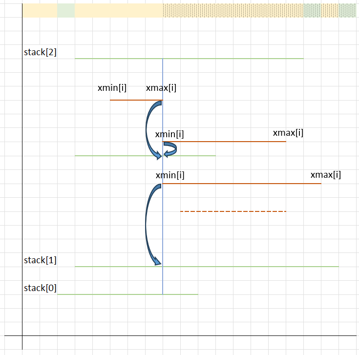
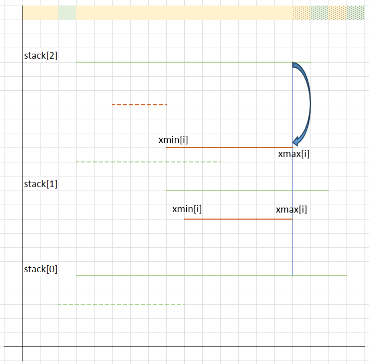

# Conveyor Chaos – solution explanation

The problem is composed of two separate problems:
* Create datastructure where each platform points to "drop point" (platform and coordinates) on their left and right
* Calculate the smallest cost from the previous structure

## Create datastructure where each platform points to "drop point" in O(n*n)

The first step is to calculate a sorted list of interval with building_intervals().  The function is O(n*log(n)) because of uncessary sorting (only knowing the min and max is needed, so could be O(n)).

The second step is to calculate, for each interval, what the target would be for a drop on the left or a drop on the right.

This could be done in O(n*n), but the size of the problem (N=500,000) would mean it is unlikely to execute in the required time. For this, for each platform, we need to test the platform that can be a destination, and take the closest target.

## Create datastructure where each platform points to "drop point" in O(n*log(n))

The first step is to calculate a sorted list of interval with building_intervals().  The function is O(n*log(n)) because of uncessary sorting (only knowing the min and max is needed, so could be O(n)).

The second step is to calculate, for each interval, what the target would be for a drop on the left or a drop on the right.

To calculate this in O(n*log(n)), we are going to parse a set of points, from left to right, representing the start and end of a platform.

We are building a list of tuples (called "points") with the following values:
* (p.xmin, p, +1)  representing the (left side of a platform p, the associated platform, and this is the right side (+1))
* (p.xmax, p, +1)  representing the (right side of a platform p, the associated platform, and this is the left side (-1))
Then we then sort this list from the left to right (first), and if the x value is the same, from top to bottom. This operation is O(n*log(n)).

The next step is about finding where platforms drop on their left and right... efficiently. 

The first set is to "fix a situation" where we have the extremity of platform (x,y) and we have a set of possible target platforms (xmin[i], xmax[i], y[i]) such as xmin[i] < x < xmax[i] for each i. This can be done trivially with a binary search if the target platforms are sorted (we simply select the first platform where ymin[i] < y).

As an initial state, we can start with a single "target" platform being the "ground".

Then we iterate over our sorted points (x sorted first, then y), and for each group of points sharing the same x value, we:
* calculate the target for either xmin and xmain (in the images, a blue arrow starts from each source and ends up at their target after using a binary search)
* update a list of intervals from which a ball can be dropped from the sky to a platform (or the ground).

Here are two examples where
* solid blue lines are the xmin or xmax values being tested in our loop.
* solid red platforms are the platform associated to the xmin or xmax being tested
* solid green platforms are stored in our stack (ordered set of platforms, using y for sorting) at the point of testing.
* the solid first line indicate "entry points" for the calculation (two colour every time a new interval is created). Solid colour indicates what is known at the point of testing (blue vertical line).

After assigning the target platforms:
* platforms ending (where x == xmax) are removed from the stack.
* platforms starting (where x == xmin) are inserted in the stack.

## Calculate the smallest cost in O(N)
